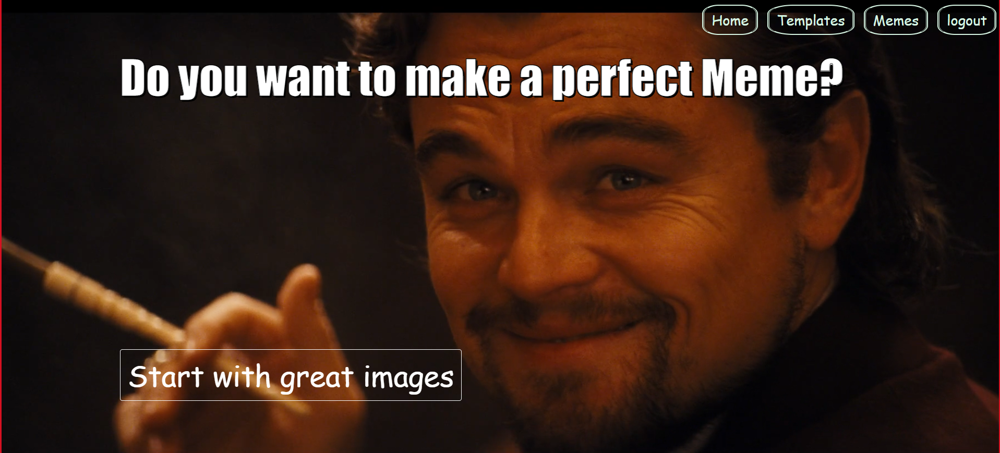
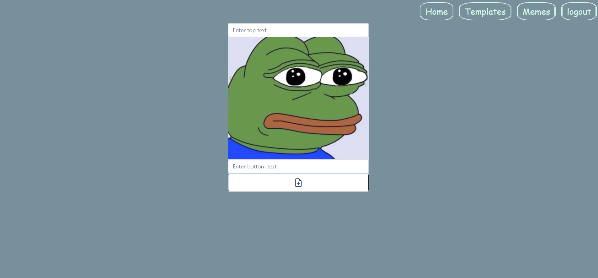

# WEB MEME - website for creating memes.

Python 3.9

------------------------------------------------------
Website allows to you create memes from existing templates or from your own pictures.
You can see gallery of memes created by you and gallery templates. Memes can be edited and deleted.

####For setting all requirements follow next command:

> pip install -r requirements.txt 

All data stored in SqlLite using SqlAlchemy.

###_main page_

###_form for creating meme_

